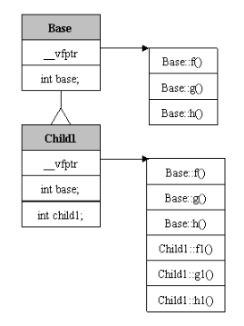

# C

FinalShell：windows免费的远程连接服务器软件

安装Clion：[【避坑】Pycharm专业版下载安装激活到2099年！](https://mp.weixin.qq.com/s/_K857VbyOfh2_jOwkni1aw)，这是我在网上找了一堆，唯一能正常破解的文章，而且注意，**一定要用文章中的Clion版本，自己从官网下载的最新版本不行！**，前期学习，用老版本无所谓，后期如果想长期使用，可以支持正版，或者自己从其他渠道购买一些便宜的激活码。

## 课题：C语言基础01-C与Java的差异化对比内存分配

### 内容点：

1、数据存储原理与内存管理

2、C&Java内存管理模型对比

3、C语言内存分配原理，Java虚拟机的内存区别

4、指针的基础概念及指针对于C语言的意义

5、对比与C，Java做了什么？

#### 语言概述

高级语言（C/Java）

虚拟机（VM/GCC/CL）

JVM指令

CPU驱动（机器/汇编）

CPU（Inter、arm）

不同厂家的cpu有着不同的指令集，而指令集不易于开发者读写，所以有了高级语言，也就是字符串，便于理解，然后通过不同语言的虚拟机，将高级语言解析成对应的cpu指令，这样，即屏蔽了不同平台的特异性，也使开发的代码便于维护。

#### cpu和内存交互

cpu通过地址总线，发送01，内存根据01确定数据的位置，然后将数据通过数据总线发给cpu。

地址总线，一根可以表示0和1，十根就是2的10次方，32位操作系统，就是2^32，= 4G，所以内存大小最大为4g。

#### 地址和指针

Java和C最大的不同，就在于对内存地址的态度

Java隐藏了地址，只能操作变量

C可以通过&，取得变量的地址。

指针相当于一个变量，专门用来存储地址的变量。C通过*声明一个指针

```c
int val = 10;
int *p; //定义指针变量
p = &val; //将val的地址赋值给p指针
*p = 100; //可以修改指针指向的地址的值。
```

指针的大小都是一样的，和操作系统有关，64位就是8，

```
sizeof(int*) sizeof(char*) sizeof(long*) 都是8，但是这些指针位移的时候，偏移量不同。
```

#### 内存对齐

保证每次从内存读取固定位的数据，比如64位系统是8位，即使是char类型的数据，存储在内存中也占8位，就是为了保证一次可以取完数据，避免多次提取一个数据，节省时间。

#### 数据类型

数据类型的本质，就是为了固定数据的容量大小。

```
char = 1字节 //与java不同，java中char=2byte
int = 2/4字节
shot = 2字节
long = 4字节
unsigned int/shot/long //无符号，地址范围从0~2x，有符号，地址范围从-x~x，
float = 4字节
double = 8字节
long double = 16字节
```

**sizeof()函数是用来测量变量的大小**

所有指针类型变量的大小都是8，这个和地址总线的大小有关，也就是和OS有关，比如

```
int *a;
char *b;
long *c;

sizeof(a),sizeof(b),sizeof(c) 都是8
sizeof(int*),sizeof(char*),sizeof(long*) 都是8
sizeof(int),sizeof(char),sizeof(long) 4 1 8
sizeof(*a),sizeof(*b),sizeof(*c) 4 1 8
```

**C的堆空间是需要手动控制申请和释放，没有Java的GC机制。**

### 总结

1、学语言，看标准，看编译器，看语法

高级语言的本质，就是去帮我们处理汇编指令集，封装成我们容易懂的语言，然后翻译成CPU能够理解的指令，

2、Java和C

C：提供指针，能够让用户操作内存地址，进行间接赋值。依托于OS的内存管理。

Java：不让用户直接操作指针，提供一个虚拟机(提取一块内存后，自己管理内存空间)，统一处理不同OS的指令集，实现跨平台。

## 课题：C语言基础02-指针详解

### 内容点：

1、指针的基本应用与存在的意义

2、指针变量与变量指针的理解

3、指针运算详解

4、指针与动态内存申请的意义

5、指针与字符串

### 知识点：

1、

位是计算机的存储单位，一位就是0/1，内存条中最小的存储单位。

字节是最小的计算单位，1字节=8位，一个地址也是由八位组成。

int = 4字节，char = 1字节，long=8字节

2、

指针变量：就是一个变量类型，内存大小固定，就是一个地址的大小，32位系统就是4，64位系统就是8

变量指针：就是变量的一个指针，就是一个地址。

3、+-运算

```
//& 取址，取普通变量的地址
int a; //&a取的就是a变量的地址
//* 取值，去指针变量所指向地址的值
int* p = &a; //*p就是去取a的值。

*++p;//上移一位指针，先移动指针，再取值，当前值已经是移动后的
*--p;//下移一位指针，先移动指针，再取值
*p++;//上移一位指针，先取值，再移动指针
*p--;//下移一位指针，先取值，再移动指针，当前值还是之前的，后续再用p，就已经是移动后的
++*p;//指针不进行移动，取值后，对值进行+1
--*p;//指针不进行移动，取值后，对值进行-1
*(p++);//上移一位指针，先移动，再取值，等价于*++p，但是衍生出多位移动 *(p+=2)
*(p--);//等价于*--p，但是衍生出多位移动 *(p-=2)
```

4、两个指针变量进行加减

```
int a = 10;
int b = 100;//c的栈内存是线性分布，由上到下。
int* p1 = &a;
int* p2 = &b;
int p3 = p1 - p2;//p3=1
//计算结果和类型有关，指针变量类型决定步长，int就是按4位=1，char就是1位=1
char* p1 = &a;
char* p2 = &b;
char p3 = p1 - p2;//p3=4
```

5、指针类型转换

```
int a = 10;
int b = 100;
int* p1 = &a;
char* p2 = &b;
//int r = p1 - p2;//类型不匹配，提前数据的位数不匹配，需要强转
int r = (char*)p1 - p2;//默认情况下，最好是大转小。r = 4，计算的就是地址差值。
```

6、指针比较

```
<,<=,==,>=,>,!=
//比较他们在内存中的地址，数组中的单元呃地址，肯定是线性分布
```

7、0地址

相当于NULL

异常指针、野指针、空指针

8、指针常量、常量指针

指针常量：固化地址，但是可以操作地址指向的内容

```
int a,b;
int* const p = &a; //指针常量
*p = 9;//可以操作地址指向的内容
//p = &b; //编译错误
```

常量指针：固化地址内部数据内容，但是可以操作地址

```
int a,b;
const int* p = &a;//常量指针
//*p = 9;//操作错误
p = &b;//可以修改地址
```

```
const int* const p = &a;//这个p指针的地址不能更改，地址指向的内容也不可更改。
```

9、指针和字符串

可以用指针接收，也可以用数组接收。

```
char* str = "I Love You!";//返回字符串常量的地址首位
char str2[] = "I Love You!";//将字符串常量复制一份到栈区，用数组接收。
```

### 总结：

指针：是操作系统对内存管理的一种特性，指针的本质就是地址。

指针变量是C提供出来，用于地址操作方案的容器

*是根据地址去取值。

## 课题：C语言03 数组与指针深入解析

### 内容点：

1、一维数组与数组内存详解

2、二维数组与数组内存详解

3、数组作为函数参数下的表现

4、数组指针与指针数组详解

### 知识点：

1、数组是开辟一块连续的内存空间

malloc(1024)只是分配了空间

数组是分配了空间，并且规定了提取规则(一次性提取几个地址，步长是多少)。

```
int arr[10];//分配了4*10个字节的地址空间

#define X = 3
int arr2[X];//可以正常分配空间

int count = 10;
int arr[count];//错误使用，不会正常分配内存空间，只是会返回一个地址。
```

2、[]操作符

下标引用操作符，它其实就是数组访问的操作符，也就是连续空间的操作符。

就是单纯的取地址，然后递增地址

```
arr[] = "abc";
int* p = "abc";
arr[x] 等价于 p + x，对应递增x个地址
```

3、C不存在数组越界

数组越界是Java语言封装的一个异常，属于业务层面，并不是语言层面。C中的[]，就是去取一个地址，然后操作它。

```
int arr[10] = {0};
int[11] = 100;
```

4、{}可以给数组赋初值

但是并不是必要的，C中的数组只是开辟一块空间，后续怎么使用随意。

5、二维数组

```
int arr[行][列]; //开辟的空间大小 行*列*4
```

二维数组在内存的空间布局上，也是线性连续的，其本质也是一个一维数组，只不过内部元素是一维数组。

```
arr[0] + 1;//增长的步长是 数据类型
arr + 1;//增长的步长是 列*数组类型
&arr + 1;//增长的步长是，整个数组大小 行*列*数据类型
```

6、数组参数

数组以参数的形式传递给一个函数时，实际传递的是一个指针，该数组的指针，指向数组的首地址。

7、指针数组、数组指针

指针数组：是一个数组，里面每个元素是指针，每个元素长度是8位。

```c
int a[5] = {1,2,3,4,5};
int b[5] = {1,2,3,4,5};
int c[5] = {1,2,3,4,5};
int* p[] = {a,b,c};//指针数组
for(int i = 0; i < 3; i++){
  for(int j = 0; j < 5; j++){
    printf("%d", *(p[i]+j));//p[i][j]
  }
  printf("\n");
}
```

数组指针：就是一个指针，8位，指向数组。

```c
int a[3][4] = {0,1,2,3,4,5,6,7,8,9,10,11};
int(*p)[4];
p = a;
for(int i = 0; i < 3; i++){
  for(int j = 0; j < 4; j++){
    printf("%2d ", *(*(p+i)+j));
  }
  printf("\n");   
}
```

8、多级指针

```
一个*就是对指针地址取一次值，多个*就是取多级值。
int a = 10;
int* p = &a;
int** p2 = &p;
**p = 20;
```

## 课题：C语言04-函数指针与指针函数

### 内容点：

1、函数执行过程与内存变化

2、函数指针与指针函数详解

3、回调函数详解

4、指针于函数参数的意义

### 知识点：

1、函数调用的内存中的三个区域

代码区（机器指令集）：代码区装载了这个程序所对应的机器指令集，程序的执行就靠这些指令来驱动。C语言的程序都是被提前翻译成机器指令的。

静态数据区（常量区、全局变量、静态变量）：装载了全局变量的数值，后面程序的执行会改变这里的值。

动态数据区（堆、栈）：初始什么都没有，因为只要程序执行后，在指令的驱动下，这个区域才会产生数据。压栈、清栈的工作就是在这个区域完成的。

2、寄存器

esp（装载栈顶位置）：记录某个函数执行的结束位置

ebp（装载栈低位置）：记录某个函数执行的开始位置

eip（装载代码位置）：记录代码指令执行的位置

等函数执行完成后，OS会根据寄存器标记的位置，清理栈区空间。

3、函数的执行过程

实际上是一系列指令的执行过程

CPU给出数据存储的两种方案：

​		1、临时存储数据（栈区）

​		一个函数单位的指令执行完成后，直接清理，对于这套方案，使用了上述三种寄存器来支撑。

​		2、长期存储数据（常量区、堆区）

​		提供对应的指令进行管理。由代码自己控制。		

4、指针函数

函数的返回值，是一个指针类型

```c
char* myStr(void){
	char* str = "Hi";//返回的常量区地址，后续可用
  char* str = malloc(20);//返回堆区地址，后续可用，但是用完要记得手动释放。
  char str[20];//数组的数据是复制一份到栈区，返回栈区地址，后续不可用，函数结束会被清理。
  strcpy(str, "Hi");
  
  return str;
}
```

指针函数中，开在栈区中的地址，不可作为返回值给外部用，因为函数结束， 栈中的地址也会被清理，后续拿到的地址会为null。

5、0是假、非0是真

if，while等判断条件，是根据0或非0来判断，没有boolean类型的true，false

6、C语言的函数里，基本上都是地址操作。

7、函数指针

是专门用来存放函数地址的指针，函数地址是一个函数的入口地址，函数名代表了函数的入口地址。当一个函数指针指向了一个函数，就可以通过这个指针来调用该函数，可以将函数作为参数传递给函数指针。

```c
//声明形式
//<函数指针所指向函数的返回值数据类型> (*<函数指针名称>) (<参数说明列表>)
//int (*fun)(int);

int plus(int, int);//函数声明，变量名可以省略，如果不声明，需要将实现写在上面

//函数指针作为参数
int test(int a, int b, int (*pFunc)(int, int)){
  	return ((*pFunc)(a, b));
}

//函数指针变量的声明
int main(){
  int (*pFunc)(int, int)
  pFunc = plus;//可以指向相同类型的函数
  printf("%d \n", (*pFunc)(x, y));
  
 	printf("%d \n", test(a, b, plus));//这里传什么函数，就执行什么函数，Java的重载和重写，就是利用这样的原理
}
         
//上面已经有了声明，就可以在下面写实现，         
int plus(int a, int b){
	return a+b;
}

//int (*pFunc)(int, int)定义太麻烦，可以自定义一个类型
typedef int (*MFunc)(int, int);
//下面代码就可以直接这样使用
MFunc pFunc;
```

**注意：* 和函数名要用括号括起来，否则因为运算符的优先级原因，就变成了指针函数。**

8、函数指针数组

```c
int plus(int, int);
int minus(int, int);

int main(){
  int (*pFunc[2])(int, int);
  
  pFunc[0] = plus;//将函数的地址当做指针放入数组
  pFunc[1] = minus;
  
  for(int i = 0; i < 2; i++){
    printf("%d \n", (*pFunc[i])(1,2));//直接对数组元素取值，就相当于调用函数。
  }
}
```

9、万能指针

```c
void* p;//可以给它赋值任何类型的指针，也就是任何地址，可以是int，char，long，数组，函数
//但是使用的时候，需要强转成对应类型才能使用。

//Java多态的原理
int test(int a, int b, void* pFunc){
  //在这里，根据条件判断，将pFunc强转成对应的类型去使用。
}
```

10、1e-6

表示1乘以10的负6次方，(也就是0.000001)叫做epsilon，用来抵消浮点运算中因为误差造成的相等无法判断的情况，它通常是一个非常小的数字。（具体多小要看你的运算误差）

比如说因为精度误差，用十进制举例，我们要算1/3+1/3+1/3==1（从数学上说，肯定相等），但是因为精度问题，等号左边算出来是0.3333333+0.3333333+0.3333333=0.9999999，

存在了误差，右边是1.0000000，那么如果直接用==，返回false，我们希望它被视作相等。那么就要两数相减取绝对值小于epslon的办法。

11、回调函数

就是函数指针的一种应用场景。

```c
void callbackFunc(){
}

void call(void (*callback)()){
  callback();//执行完后，调用被回调的函数，实现回调。
}

int main(){
  call(callbackFunc);//主动调用某个函数，把被回调函数传入
  return 0;
}
```

### 总结：

C语言的精髓：内存管理和地址操作，即指针。

指针：指针数组(元素是指针的数组)、数组指针、指针函数(返回值是指针的函数)、函数指针、常规指针，只需要理解指针类型的概念，C里面的指针变量，是用来装地址，操作地址空间。操作的依据(步长，方案)的来源是类型。

```
int* p; 步长是数据类型，4长度的* p

int (*pFunc)(int, int) ; 一个函数长度的* pFunc

char str[20] = {0}; 20长度的* str
```

类型决定操作的步长，操作依赖于 + - 进行地址移动，注意运算符的优先级。

## 课题：C语言05 编译过程与链接过程

### 内容点：

1、C语言从编译到执行流程

2、C语言编译过程与链接过程详解

3、宏定义与文件头的应用

4、动态链接与so库的使用

### 知识点：

[从JVM谈C/C++编译流程](https://blog.csdn.net/dd864140130/article/details/82904053)

#### 1、gcc编译流程

对比Java：x.java->javac->class->给jvm加载，汇编转换是在运行期。

c在运行之前，就把对应的汇编全部转完。这个过程分为4步。


##### 预编译：

目的是为了处理C代码，比如#开头的代码、合并代码、删除注释、处理宏代码。

```c
#include 
#define
#if
#elif
#endif
```

1、将所有的#define删除，并且展开所有的宏定义，实际上就是字符替换。

2、处理所有的条件编译指令，#ifdef #ifndef #endif等，就是带#的那些。

3、处理#include，将#include指向的文件插入到该行处。

4、删除所有注释。

5、添加行号和文件标识，这样在调试和编译出错的时候才知道是哪个文件的哪一行。

6、保留#pragma编译器指令，因为编译器需要使用。

##### 编译、汇编：

编译的过程实质上是将高级语言翻译成汇编语言->机器码。

1、扫描（词法分析，将源代码的字符序列分割成一系列的记号token）

2、语法分析（将token生成语法树）

3、语义分析（静态语义、动态语义）

4、源代码优化

5、代码生成

6、目标代码优化

##### 链接：

内存分配，符号决议，重定位。

合并符合表（合并段表/符号决议），一个文件中的符号，可能就是一个占位，实际引用的是另一个文件的符号，合并之后就可以找到真正的代码定义。

```c
extern int a;//是声明，不是定义，后面的代码可以使用a，但a是在其他文件中定义的。
int a;//既是声明，也是定义。

//.h文件中定义的函数，其实现都在对应的.c文件
```

#### 2、符号表

符号<-->内存地址对应表，不同的系统，基础so库加载位置不同，可以配置。比如常用的stdio，string等都在系统默认的lib库里。

```
#include <stdio.h> 尖括号引用的是默认库，
#include "string.h" 双引号可以指定具体路径
```


#### 3、CMake使用Cmakelist来管理，NDK-build使用Android.mk

#### 4、so库

是动态链接库，在链接时加载。

#### 5、宏定义

[C 预处理器](https://www.runoob.com/cprogramming/c-preprocessors.html)

处理阶段是预编译阶段，只是一个文本占位，不会进入编译期。

作用：

1、用于适配环境，比如判断不同的操作系统

```c
#ifdef MAX_OS
	//mac系统的情况
#elif
	//其他系统的情况
#endif
```

2、避免重复导入，比如.h文件都会有

```c
#ifndef LEARNC_TEST_H
#define LEARNC_TEST_H
 //此处是各种声明
#endif
```

3、定义一些常用的变量或者函数 (不常用)

```c
#define NUM 10
#define MAX(X, Y) ((X)>(Y) ? (x) : (y))
#define SQUARE(X) (X*X)
//宏不是传值，只是一个文本替换

int main(){
	int a = NUM;
  MAX(2,3);
  SQUARE(5);//25
  SQUARE(5+1);//11，因为实际上是 5+1 * 5+1
}
```

4、预定义宏

系统事先定义好的一些宏，方便操作

| __DATE__ | 当前日期，一个以 "MMM DD YYYY" 格式表示的字符常量。 |
| -------- | --------------------------------------------------- |
| __TIME__ | 当前时间，一个以 "HH:MM:SS" 格式表示的字符常量。    |
| __FILE__ | 这会包含当前文件名，一个字符串常量。                |
| __LINE__ | 这会包含当前行号，一个十进制常量。                  |
| __STDC__ | 当编译器以 ANSI 标准编译时，则定义为 1。            |

## 课题：C语言06 结构体、复杂函数、IO

### 内容点：

1、结构体的意义及结构体对齐

2、如何正确的阅读复杂函数

3、linux下的IO访问体系详解

4、系统IO与标准IO详解

### 知识点：

1、本质上是一种内存分配手段

数组：多个相同类型的数据集合，开连续内存，规定好提取规则

结构体：多个不同类型的数据集合，自定义提取规则

```c
typedef struct Stu{
	char name[20];//20个字节
	int age;//4个字节
}Stud;//这里是别名，起别名必须有typedef

int main(){
  Stu s1;
  //如果有别名，可以直接使用
  Stud s2;
}
```

2、结构体的内存对齐

原因：

​		字节对齐主要是为了提高内存的访问效率，比如intel 32位cpu，每个总线周期都是从偶地址开始读取32位的内存数据，如果数据存放地址不是从偶数开始，则可能出现需要两个总线周期才能读取到想要的数据，因此需要在内存中存放数据时进行对齐。

计算公式：

​	1、第一个成员在结构体变量偏移量为0 的地址处

​	2、前面变量的地址必须是后面地址的整数倍，不是就补齐

​	3、整个struct的地址必须是最大变量字节数的整数倍。

以通过#pragma pack修改 **对齐数**，但修改只能设置成1，2，4，8，16。

这里不太好懂，可以自己多调试看看

```
typedef struct N{
	char a; 
	int b;
	double d;
	char* aa;
	int* bb;
	doublt* dd;
	char c[];
	int cc[];
	double ccc[];
}N;//sizeof(N) = ?
```

3、复杂函数

核心在于指针数组，数组指针和函数指针，指针函数的表达式。

这四个东西作为参数和返回值，多层嵌套，就会形成复杂函数。

```
int* arr[5]; //指针数组

int arr[10];
int* p = arr; //数组指针

int (*p)(int);//函数指针

int* fun();//指针函数
```

这篇[博客](https://tehub.com/a/8zThbTXDtJ)里有一些例子，帮助分析。

4、IO

Linux下一切皆文件。

**文件描述符**，是内核为了高效的管理已经被打开的文件所创建的索引，它是一个非负整数，用于指代被打开的文件，所有执行IO操作的系统调用都是通过文件描述符完成的。

一个进程中维护这一个**fd表**，**fd表**记录着**被打开文件表**的id，**被打开文件表**记录着文件的偏移量和各种状态以及**I-Node表**的Id，**i-Node表**记录着文件具体的磁盘地址。

程序就是根据这样的表关系，根据fd操作对应的文件。

```c
#include <unistd.h> //linux下主要是posix函数
```

向一个文件中写入数据大致分以下几个步骤：

```
//1、打开文件
int fd = open(filename, openFlag, 权限);
//2、准备写入的数据
char *buf = "hello";
//3、获取字符串大小
int len = strlen(buf);
//4、写入数据到文件中
write(fd, buf, len);
//5、关闭文件
close(fd);
```

读取文件：

```
//1、打开文件
int fd = open(filename, O_RDONLY);//只读的形式打开文件
//2、获取文件大小
int len = lseek(fd, 0, SEEK_END);//先将指针偏移到文件末尾，获取文件末尾指针位置，即可获得文件大小。
//3、将文件指针偏移到文件头
lseek(fd, 0, SEEK_SET);
//4、创建一个缓冲区来存放读取到的数据
char buf[len];//创建一个大小与文件大小相同的字符数组。
//5、读取数据
read(fd, buf, len);
//6、打印
for(int i = 0; i < len; i++){
	printf("%c", buf[i]);
}
//7、关闭文件
close(fd);
```

5、两类IO

系统IO：如上，操作形式上依托于OS的设计，以文件(句柄)描述符为操作单位。

标准IO：抽象成一个结构体，FILE，推出了一套逻辑封装

```c
#include <stdio.h>

FILE *fp = NULL;
char buff[1024];
//打开文件
fp = fopen(filename, op_mode);

//读
while(TRUE){
	int flag = fget(buff, 3, (FILE*)fp);
  if(flag == EOF){
    break;
  }
  printf("flag:%d |data: %s \n", flag, buff);
}

//关闭文件
fclose(fp);
```

mode的种类


如果处理的是二进制文件，则需要用下面的访问模式来取代上面的

"rb", "wb", "ab", "rb+", "r+b", "wb+", "w+b", "ab+", "a+b"

6、IO缓存

系统IO的没有缓存控制，标准IO有一个64k的缓存控制。

## 课题：07 C++与C语言的设计差异

内容点：

1、引用、命名空间详解

2、类机制的引入目的与结构体差异详解

3、Class与Struct内存结构分析

4、构造函数与析构函数详解

知识点：

1、C++与C

C++是C的一个扩展

C++的编译过程与C相同，使用的都是gcc编译工具，只不过如果是.c文件会使用cci编译，如果是.cpp文件会用g++编译。

2、命名空间

namespace abc{

}

是为了防止名字冲突而引入的一种机制。

3、:: 域访问符号

java中所有的访问都是. ，命名空间中所有的内容，需要用::进行访问（abc::变量/函数），所有的代码都有一个命名空间包裹。

main函数有自己的默认命名空间，可以用::，也可以省略

```c++
#include <iostream>
using namespace std;//这句话可以说在当前文件中，省略std这个命名空间
int main(){
  cout<<""<<endl;//如果没有using namespace std，必须加上
  //std::cout<<""<<std::endl;
}
```

4、匿名的命名空间

为了去替代static的使用，定义全局变量

namespace{

}

我们自己没有起名字，但是编译器会给

5、类和对象机制

Class的设计，是为了强制统一对象的特征和行为，避免出现一些业务异常。所以对象都是根据类的模板去生成。

6、类类型 和 类指针

```c++
class book{
  void print_book(){
  }
}

int main(){
  //这是声明一个类类型的变量，类变量操作需要用 .
  book b1 = *new book();//new book()是开辟一块空间之后，给你一个指针，用*提取指针指向的地址。
  b1.print_book();
  //这是声明一个类指针变量，指针变量操作必须用 ->
  book* b2 = new book();
  b2->print_book();
  return 0;
}
```

7、虚函数

```c++
class Animal{
  private:
  int height;
  public:
  virtual void say(){//虚函数在基类中可以有定义
    cout <<"Hi Animal"<<endl;
  }
  virtual void run() = 0; //纯虚函数在基类中无定义，=0表示函数指向一个空地址。强制子类去实现。
};

class Cat :public Animal{
  private:
  int color;
  public:
  void say(){//重写虚函数
    cout <<"Hi Cat"<<endl;
  }
  void run(){//必须重写纯虚函数
    cout <<"run Cat"<<endl;
  }
}
```

8、虚函数表

什么都没有的情况，在c中默认大小是0，在c++中默认大小是1，但是相当于0。

正常变量、函数，就按正常变量类型计算，内存需要对齐。

有虚函数的类对象，在其头部会加一个指针，指针指向虚函数表，相比正常类对象多8个字节，存在内存对齐情况会有变化。

如果子类继承基类，子类也有虚函数，但是子类没有继承父类的虚函数，那么子类也会有一个指针指向自己的虚函数表，这个表中包含基类中的虚函数。



如果子类继承了父类的虚函数，那么在自己的虚函数表中，会用自己的虚函数地址，替换父类虚函数


子类继承了多个父类时，从第二个父类开始，会多添加一个父类虚函数表指针。第一个继承的父类中变量的对齐和其他父类不同，会独占8位。


多重继承，不管继承多少层，都遵循上面的规则。


虚继承，不会合并父类虚函数表

```
class Child: virtual public Base{}
```

9、this关键字

this是一个指针，指向当前对象。

10、类的内存

函数中声明的类，引用在栈中，对象在堆中

```c++
class b{
}
int main(){
  //b1,b2对象引用都在栈中
  b b1;
  b b2 = *new b();
  //new b()实际对象在堆中
  return 0;
}
```

11、析构函数

class的内存回收，由OS承担，正常情况下，函数结束，触发析构函数。

但是如果类作为返回值，并且在函数调用处，有变量去接，然后使用的情况下，不会在函数结束触发析构函数，等使用结束后，才会触发。

```c++
class b{
	public:
  int b;
  ~b(){}//析构函数，调用，释放内存
}
b get_b(){
	b b1 = *new b();
	return b1;
}
int main(){
  //b1,b2对象引用都在栈中
  b b1;
  b b2 = *new b();
  //new b()实际对象在堆中
  
  b b3 = get_b();//这个b3可用吗?前面了解到函数体结束，其栈会被清空。
  b3.b;//但是这里可以正常使用b3
  return 0;
}
```

## 课题：08 C++函数构造、析构、内联

### 内容点：

1、C++编译器构造析构方案 pk 对象显示初始化方案

2、拷贝构造函数详解

3、内联函数详解

4、C++函数默认参数与重载

5、this关键字的本质

### 知识点：

1、构造函数和析构函数

C++为了去匹配面向对象的业务特性，方便对Class的数据管理，添加了

构造函数和析构函数。

构造函数：开辟空间，初始化数据

析构函数：释放空间，同时提供一个特定的位置，对于class内部数据进行释放。

```c++
class Test{
  int a;
  int *p;
  //无参构造，如果什么构造函数都不写，默认会生成一个无参构造
  Test(){
  }
  //有参构造
  Test(int a){
  }
  //析构
  ~Test(){
  }
}

int main(){
  Test a;//调用无参构造
  Test b(10);//调用有参构造
  Test c = (1);//调用有参构造
  Test d = *new Test();//调用无参构造
  Test e = *new Test(10);//调用有参构造
  Test f(a);//调用拷贝构造
  Test g = a;//调用拷贝构造，等价于new Test(a);
  return 0;
}
```

2、拷贝构造函数

和Java不同的地方，C++提供了拷贝构造函数。

Java：默认不写构造，会给你一个无参构造

C++：默认不写构造，会提供一个无参构造，一个拷贝构造

```c++
Test t1;
Test t2 = t1;//调用了Test(t1),拷贝构造函数

//相当于这样的拷贝构造函数
Test(Test& t){
  this->a = t.a;//值的拷贝，是深拷贝,t1,t2的a互不影响
  this->p = t.p;//地址的拷贝，是把地址直接给过去，t1，t2的p会互相影响
}
```

Java中，t1,t2只是两个引用，他们指向的是同一个对象，t1，t2的a会互相印象。

C++中，t1，t2是两个空间，是两个不同的对象，只是他们里面的数据，会指向同一个数据地址。如果是普通类型的变量，不会互相影响，如果是指针类型，那会互相影响。

3、深浅拷贝

```c++
//深拷贝
int a = 5;
int b = a;

//浅拷贝
int *p;
p = &a;

char* c1 = "Hello";
char* c2 = c1;

//指针拷贝变为深拷贝
int *q = new int;
*q = a;

char* str1 = "Hello";
int const len = strlen(str1);
char *str2 = new char[len];
memcpy(str2, str1, len);
```

上面Test对象进行析构，只会释放a和p的内存，并不会是否p指向的数据内存，如果想真正的释放p所指向的内存，需要手动在析构函数释放

```c++
~Test(){
  delete p;//释放p所指向的内存地址。
}
```

但是这样，会有一个问题，我们创建了两个对象t1,t2，他们都进行析构，会重复释放p所指向的内存，会报错。所以我们需要在拷贝构造时，将p改成深拷贝

```c++
Test(const Test& t){
  a = t.a;
  p = new int;//新开一块地址
  *p = *(t.p);//将t的p的值，复制给p
}
```

这样，t1，t2两次析构，p的内存互不影响。

4、构造函数的调用方式

```c++
//无参构造调用
Test t;
Test t();
Test t = *new Test();
//拷贝构造的调用
Test t2(t1);
Test t2 = t1;//这里和下面完全是两种不同的意思。这里的=是初始化，
//这里注意
Test t3;//这里已经调用无参构造，对象已经创建
t3 = t1;//这里=只是地址复制，不会调用构造，因为对象已经创建
//这跟表达式有关。
```

5、对象作为函数参数

```c++
//对象作为参数
void testFunc1(Test t){
	//t是一个新对象，会调用t的拷贝函数
}
//地址作为参数
void testFunc2(Test& t){
  //t就是调用方传的那个原对象，不会开辟新地址
}
//指针作为参数
void testFunc3(Test* t){
  //t是一个指针，开辟了新地址，指向调用着传递的对象
}
```

6、对象作为返回值

```c++
//返回对象
Test retFunc1(){
  Test t;
  return t;
}
//返回对象地址
Test& retFunc2(){
  Test t;
  return t;
}
//返回指针
Test* retFunc3(){
  Test t;
  return t;
}

int main(){
  Test t1 = retFunc1();//返回的是对象，直接给t1赋值，不会调用拷贝构造，函数中的t，会在t1使用结束后析构。
  
  Test t2 = retFunc2();//函数中的t，会析构，然后触发拷贝函数创建t2。
  
  Test* t3 = retFunc3();//函数中的t，会析构，返回的是指针，不会触发拷贝,t3是指向t对象的内存地址。
  return 0;
}
```

7、内联函数

宏函数的意义：简单代码的处理上，提高效率。

为了去解决C的宏函数的方案，做了一定优化，比如可以定义参数类型，可以校验参数，可以编写更复杂的代码。运行策略等同于宏函数，内联函数的的代码会被放入符号表中，在预处理阶段，直接进行替换。

但是过于复杂的内联函数，会被当成普通函数。

```c++
inline int add(int x, int y){
  return x+y;
}

int main(){
  cout << "5+8=" << add(5,8) <<endl;
  return 0;
}
```

8、函数默认参数

```c++
void show(int a = 10, int b = 2);
int main(){
  show();//默认a=10, b=2
  show(5);//a=5, b=2
  show(5,6);//a=5, b=6
  //show( ,4);//非法调用
  return 0;
}
void show(int a, int b){
  
}
```

9、函数重载

相同函数名，不同参数类型

```c++
void show(int a);
void show(int a, double b);
//实际上，c++会生成show_int,show_int_double的符号，分别指向对应的函数

//那么对于有默认参数的函数声明，它会生成两个符号，指向同一个函数
//show_int_double_float和show_int_double
void show(int a, double b, float c = 10);
//这个时候如果再想写一个void show(int a, double b){}，就是重复定义了。
```

10、占位参数

暂时用不到，用于以后扩展，还有一方面是为了兼容C的一些不规范的语法。

```c++
int func(int a, int b,int){//最后一个参数在函数中目前不可用，但是以后可以扩展使用
  return a+b;
}
int main(){
  int r = func(1,2,3);//调用方需要传第三个参数
  return 0;
}
```

后面func函数更改以后，不需要调用方改变代码。

11、this

Java的this，是生成在栈区的局部变量表中，为每个类都会生成，指向当前类对象。

C++对于每个类的方法，都会默认添加第一个参数是当前类对象的指针，谁调用，就会把谁传递给该方法。

```c++
class stu{
  public:
  void setName(char *name);
  private:
  char *name;
};
//这个方法编译后会成为void stu::setName(stu* this, char* name)
void stu::setName(char* name){
  this->name = name;//所以当前this就是传进来的那个stu对象的指针
}
int main(){
  stu s;
  s.setName("zhang");//实际上，s被当做第一个参数this传进去
}
```

## 课题：09 C++友元函数、运算符重载、模板

### 内容点：

1、友元函数详解与应用场景

2、运算符重载详解

3、C++泛型模板机制

4、使用模板机制开发ArrayList

### 知识点：

1、友元函数

C++的封装性，固化了访问权限，但是有特殊场景需要在其他部分，使用自己的私有成员。所以提出了友元。如果不想用友元，就需要提供一系列的公共get/set方法。

[C++友元函数和友元类（C++ friend）详解](http://c.biancheng.net/view/169.html)，这里讲的非常详细。

```c++
//一个正常的方法，函数符号是 A::funcA
//全局友元函数的符号是 outAccessA
//某个类的友元函数符号是 B::accessA
#include <iostream>

using namespace std;
class A;

class B{
private:
    int b;
public:
    void funcB(A* a);//不可访问A的私有变量
    void accessA(A* a);
};

class A{
private:
    int a;
public:
    void funcA(A a);
    friend void B::accessA(A* a);//将B的accessA设为自己的友元函数
    friend void outAccessA(A* a);//提供全局的友元函数
    friend class C;//将C设为自己的友元类
};

class C{
private:
    int c;
public:
    void funC(A* a);//自己是A的友元类，所有函数可以访问A的私有变量
};

//自己调用自己，可以访问自己的成员
void A::funcA(A a){
    a.a;
}
//外包调用，不可用访问A的私有成员
void outAccessA(A a){
    //a.a;//获取不到私有属性
}
//A将B的accessA添加为友元函数，B可以访问A的私有成员
void B::accessA(A* a) {
    a->a;
}
//A提供了全局友元函数，外部可以访问A的私有成员
void outAccessA(A* a){
    a->a;
}
//B的普通函数，不可以访问A的私有成员
void B::funcB(A* a) {
    //a.a;//
}
//C的普通函数，也可以访问A的私有成员
void C::funC(A *a) {
    a->a;
}
int main(){
    A a;
    B b;
    b.accessA(&a);
    outAccessA(&a);
    return 0;
}
```

2、运算符重载

C体系中，所有的运算符，都是一组函数调用。可以自己实现。

```c++
class P{
  private:
  int x;
  public:
  P operation+(P &p){//重载运算符+，可以+一个自身对象
    P temp;
    temp.x = this.x + p.x;
    return temp;
  }
  int operator+(int x){//重载运算符+，可以+一个数字
    this->x += x;
  }
}

//重载全局+，使得5 + p3;可以正常运行，全局运算符重载，第一个参数默认就是 + 前面的那个值。
int operator+(int x, P& p){
  return p+x;
}
int main(){
  P p1;
  p1.x = 10;
  P p2;
  p2.x = 10;
  P p3 = p1 + p2;
  
  int t1 = p3 + 5;
  int t2 = 5 + p3;
  return 0;
}
```

3、泛型

c++中其实叫模板

```c++
template <class T>//T表示泛型类
T Inc(int n){
  return 1+n;
}
int main(){
  double d = Inc<double>(4);//这里传什么类型，返回的就是什么类型
}
```

4、explicit关键字

只能用于类内的单参构造函数前面，标明构造函数是显示的，而非隐式的，类构造函数默认是implicit 隐式。

```c++
class T{
	explicit T(int a);
}
```

### 总结：

C++开发 ，核心在于内存管理，内存控制。

要点在于：

1、函数的参数和返回值有class的情况下，需要考虑，类做参数和返回值的三种场景：

Class 拷贝

Class* 无拷贝，会生成新指针

Class& 无拷贝，共享地址，但是一个地方修改数据，其他地方受影响，如果有地方析构，那么其他地方使用就会报错。

## 课题：10 STL之内存管理与容器（智能指针）

### 内容点：

1、结合Java内存管理体系，引出C++中内存管理的思考

2、堆区管理问题与智能指针出现的目的

3、智能指针分类详解

4、智能指针的运用详解

### 知识点：

1、C++内存管理

- 静态存储区：它是由编译器自动分配和释放的，内存在程序编译期就已经分配好，这块内存在程序整个运行期间都存在，直到整个程序运行结束时才被释放，如全局变量、static变量、常量。特点是量小、存在时间长。
- 栈：它同样也是由编译器自动分配和释放，在函数执行时，函数内的局部变量都在栈上创建， 函数执行结束时，这些存储单元将被自动释放。特点是临时数据。
- 堆：也被称为动态内存分配，它是由程序员手动完成申请和释放的。malloc(size)来申请任意size的内存，free()来释放。分配了就必须要释放，否则会引起内存泄露。特点是需要较长时间存在。

对比Java:

常量区、静态数据区

栈区：临时数据

堆区：一定有效期的数据，Gc回收

C++栈区变量的大小不要超过OS的位数（32/64)，数据大于32位的时候，就推荐放到堆上。

2、指针经常出现的问题

1. 悬空指针被使用，内存已经释放，但是指针没有改变指向，后续再操作指针对应的数据，就会出错。
2. 二次释放，已经释放过，再次释放，比如拷贝构造一个新对象，对象内指针指向同一块内存地址，新老对象都去释放这块内存就会出现问题，
3. 内存泄露，比如 U u = *new U(); new出这这块内存，无法管理，必定泄露。

3、智能指针

为了解决指针常出现的问题，推出了智能指针。

智能指针是对普通指针的一个封装，也是一个指针。实现思路：

1. 依托于栈的回收机制，触发析构
2. 写一个类代理真正的指针数据
3. 自己加业务逻辑去控制数据的释放

auto_ptr，内部实现是一个class，当这个class在析构的时候，去释放指针。但是存在二次释放的隐患，已经被弃用。

shared_ptr，在auto_ptr的基础上加上(count)引用计数，构造、赋值等操作会+1，赋NULL或者析构会-1，只有在-1之后count==0的话，才会释放指针。

unique_ptr：申请一块内存地址，只允许一个指针指向这块地址，保证指针的唯一性。强引用指针

shared_ptr：一种强引用指针，多个shared_ptr指向同一处资源，当所有shared_ptr释放，该处资源才释放。强引用指针，会存在循环引用问题，导致内存泄露。

weak_ptr：弱引用指针。不会影响shared_ptr的引用计数。可以解决双向引用问题。

```c++
//初始化方法
std::unique_ptr<int> up1(new int(123));
std::unique_ptr<int> up2;
up2.reset(new int(123));
//auto_ptr存在的问题
std::auto_ptr<string> p1(new string("data1"));
std::auto_ptr<string> p2;
p2=p1;//编译器认为合法，但后续对p1继续使用，会导致程序出错，因为p1不再指向有效数据。auto_ptr会析构释放数据。
//保证唯一
std::unique_ptr<string> p3(new string("data2"));
std::unique_ptr<string> p4;
p4=p3;//编译器认为非法，避免了p3不再指向有效数据问题。

//官方封装unuque_ptr、shared_ptr就是让我们不再使用new运算符，避免安全隐患。实质上，它只是封装了一下，里面也是new，其实是一样的。
std::unique_ptr<int> up3 = std::make_unique<int>(123);
std::unique_ptr<int> up4(std::move(up3));//通过移动实现复制操作。move主要目的是要保证数据只要一份，清空原来的，将数据保存到下一个。
std::unique_ptr<int> up5;
up5 = std::move(up4);
//up3、up4都为空，up5不为空。

//nullptr 指针是否为空
```

4、多线程下智能指针存在问题

多线程使用同一块内存，一个线程释放了内存，另一个线程使用时，会出现指针悬空问题。可以使用智能指针来解决。

多线程写同一个变量，可能因为线程切换，赋值操作和引用计数操作可能会出现错乱，最终导致指针悬空。需要加锁来解决。

## 课题：11 C++ STL之线程管理

### 内容点：

1、从内核角度看进程与线程的实现

2、C++对于线程的控制实现

3、C++线程安全处理策略

4、线程同步与条件变量

### 知识点：

1、内核

内核就是一套软件，就是OS这套系统，对于所有硬件的协调软件。


[在线内核源码](https://docs.huihoo.com/doxygen/linux/kernel/3.7/)

2、进程和线程

每个用户所编写的程序，需要运行在系统，就叫进程，每个进程有自己的进程描述符，包含了内核管理进程所需的全部信息。

cpu的时间片轮转，会出现进程的切换，就涉及到上下文的读写，也就是对进程描述符的读去和存储。会有较大的开销。

线程和进程类型，都是一个task_struct的结构体，里面存储了各种需要的信息。

C++创建一个线程，就是将其加入了线程表，就能接收资源分配。系统会根据cpu的轮转，给线程表中的线程，根据优先级等分配资源去运行。

3、线程管理方案

​	1、用户线程管理

​	2、内核线程管理

每个语言的**线程库调度器**实现不同。

线程数据的维护

​		存放地点：

​			用户空间(3G)

​			内核空间(1G)

4、C++线程API

C和C++用的都是pthread.h的库

```c++
#include <pthread.h>
pthread_t tid;//pthread_t是一个线程信息的struct
pthread_create();//创建，友元函数
pthread_exit();//退出
pthread_join();//等待
pthread_cancel();//取消
pthread_self();//获取ID
pthread_detach();//分离，只有调用了分离，线程所占用的空间才能被释放。
SCHED_OTHER、SCHED_FIFO、SCHED_RR;//调度策略
//通信机制  信号、信号量、互斥锁、读写锁、条件变量
```

5、线程安全

多线程操作共享数据会出现脏数据，也需要锁来控制

```c++
pthread_mutex_t g_lock;//互斥锁，相当于有一个计数器，0不可获取，1可以获取。

void* fun(void* arg){
  pthread_mutex_lock(&g_lock);//即将访问临界资源，加锁
  //代码
  pthread_mutex_unlock(&g_lock);//解锁
}

int main(){
  pthread_mutex_init(&g_lock, NULL);//初始化锁
  //多线程调用fun();
  pthread_mutex_destroy(&g_lock);//销毁锁
}
```

6、死锁

​	1、如果调用lock，没有unlock，那么就会出现死锁。

​	2、两个线程互相拿住对方的锁。

7、条件变量

C++中没有wait、notify这样的函数，提供条件变量来控制线程的唤醒和等待。

```c++
pthread_cond_t g_cond;//条件变量，实际上是一个队列

pthread_cond_wait(&g_cond, &g_lock);//将锁放入队列
pthread_cond_signal(&g_cond);//通知队列有锁释放。
```

生产者消费者使用同一个队列，在多线程的情况下会出现死锁，所以需要给生产者和消费者不同的两个队列，防止死锁。

## 课题：12 NDK开发之JNI编译与运行

java native interface

### 内容点：

1、JNI静态注册和动态注册

2、JNI方法调用原理

3、JNI函数签名由来

4、签名保存的正确方式

### 知识点：

1、java工程->JNI工程

当你创建一个C++工程的时候，这些都是默认生成的，这里只是列出区别。

1. 创建cmake目录及文件

   

   系统默认创建在src/main/cpp中，CMakeLists.txt以及C文件都在这个目录。

2. app的build.gradle中配置cmake

   ```groovy
   android {
     defaultConfig {
       externalNativeBuild {
         cmake {
           /***
           1、Exceptions Support：启用对 C++ 异常处理的支持，
            新建工程选中此复选框Android Studio 会将 -fexceptions
            标志添加到模块级 build.gradle 文件的 cppFlags 中，Gradle 会将其传递到 CMake。
           2、Runtime Type Information Support：支持 RTTI，新建工程选中此复选框，Android Studio 会将 -frtti 标志添加到模块级 build.gradle 文件的 cppFlags 中，Gradle 会将其传递到 CMake。
            */
           cppFlags '' //默认不勾选，就是空值
         }
       }
     }
     //指定CMake脚本的路径
     externalNativeBuild {
       cmake {
         path file('src/main/cpp/CMakeLists.txt')//路径
         version '3.18.1'//版本
       }
     }
   }
   ```

3. CMakeList文件配置

   ```
   #指定版本
   cmake_minimum_required(VERSION 3.18.1)
   #SO库的名字
   project("jnilearn")
   #配置动态库
   add_library( # 名字Sets the name of the library.
           jnilearn
           # 类型：动态库Sets the library as a shared library.
           SHARED
           # 源文件路径Provides a relative path to your source file(s).
           native-lib.cpp)
   #配置需要链接的库
   find_library( # Sets the name of the path variable.
           log-lib
           
           # Specifies the name of the NDK library that
           # you want CMake to locate.
           log)
   #配置 自己的工程和链接库 进行链接
   target_link_libraries( # Specifies the target library.
           jnilearn
   
           # Links the target library to the log library
           # included in the NDK.
           ${log-lib})
   ```

4. native_lib.cpp

   ```c++
   #include <jni.h>
   #include <string>
   
   extern "C" JNIEXPORT jstring JNICALL
   Java_com_jnilearn_MainActivity_stringFromJNI(
           JNIEnv* env,
           jobject /* this */) {
       std::string hello = "Hello from C++";
       return env->NewStringUTF(hello.c_str());
   }
   ```

   1、extern "C"

   指定cpp文件的代码用C编译器进行编译。

   C和C++是两个不同的编译器进行编译，他们对函数最终生成的符号不同，因为C没有重载的概念，符号就是函数名，但是C++有重载，符号是函数名_参数变量类型。

   2、JNIEXPORT

   是一个宏，代表访问权限，default是可访问、hiden是不可见，外部不可调用

   ```c++
   #define JNIEXPORT  __attribute__ ((visibility ("default")))
   ```

   3、返回值jstring

   返回类型，也需要将c的类型转化成Java类型。

   ```c++
   std::string hello = "Hello from C++";
   return env->NewStringUTF(hello.c_str());
   ```

   4、JNICALL

   标识这是一个jni函数，要不要都行

   5、Java_com_jnilearn_MainActivity_stringFromJNI 

   这是一个静态注册，

   ```
   命名方式：Java_包名_类名_方法名
   ```

   6、参数JNIEnv

   属于JNI的一个环境，可以调用一系列JNI的方法，来连通Java和C++的内存。可以看作是一个转换器。

   7、参数jstring

   实际上是一个Java方法区的内存地址，我们需要将其转化成C++的内存地址后才可以使用

   ```c++
   const char* c = env->GetStringUTFChar(jstr, isCopy);//isCopy 0不复制，1复制一份到C的内存。
   
   delete c;//用完之后需要释放
   ```

   8、参数Jobject，Jclass

   如果Java方法是普通方法，传过来的就是Jobject

   如果Java方法是静态方法，传过来的就是Jclass

   9、C调用Java

   实质上是使用反射。

   ```
   //1、获取class
   jclass aClass = env->GetObjectClass(thiz);
   //2、获取属性
   jfiledID idText = env->GetFiledID(aClass, "text", "Ljava/lang/String;";
   //获取方法
   //env->GetMethodID(aClass, "callback", "(I)V");
   //3、赋值
   jstring t1 = env->NewStringUTF("hi");
   env->SetObjectField(thiz, idText, t1);
   ```

2、类型转换

Java -> JNI -> C，其中JNI的类型只是一个内存结构，可以看作一个指针，指向具体的数据。没有实际数据。

对象类型需要加分号

参数类型对照：


属性描述符和函数描述符

JNI属性描述符：也就是变量类型在JNI中的表示方式


[JNI系列(四)JAVA数据类型和JNI类型对照表](https://blog.csdn.net/u011781521/article/details/106955363)

3、动态注册：

Java在加载SO库时，就会调用JNI_OnLoad方法，此时在这里注册方法。注册的方法会在一个JNINativeMethod的数组中，类似一个方法注册表，表是有索引的，使用的时候直接查表就行。

```c++
jstring stringFromJNI(JNIEnv *jniEnv, jobject obj){
  return jniEnv->NewStringUTF("hello from C++");
}

static const JNINativeMethod nativeMethod[] = {
  {"fun",//Java中的函数名
   "()Ljava/lang/String;",//函数签名信息
   (void *)(stringFromJNI),//native的函数指针
  },
};

JNIEXPORT jint JNICALL JNI_OnLoad(JavaVM* vm, void* reserved){
  JNIEnv *env = NULL;
  //初始化JNIEnv
  if(vm->GetEnv(reinterpret_cast<void **>(&env), JNI_VERSION_1_6) != JNI_OK){
    return JNI_FALSE;
  }
  //找到需要动态注册的JNI类
  jclass jniClass = env->FindClass("com/jni/MainActivity");
  if(nullptr == jniClass){
    return JNI_FALSE;
  }
  //动态注册
  env->RegisterNatives(jniClass, nativeMethod, sizeof(nativeMethod)/sizeof(nativeMethod[0]));
  //返回JNI使用的版本
  return JNI_VERSION_1_6;
}
```

相比于静态注册，动态注册不必在每次运行调用Native方法都去进行方法查找，所以相对来说动态注册的性能更高一些。

4、反编译工具

IDA、objection

5、密钥存储

存储在Java层是非常不安全的

存储在C层的so库相对安全

C层获取密钥的方法对apk签名进行验证，防止任何人都可以调用。

C层使用反射，获取签名（Java层签名可以通过PackageManager获取）。

具体代码参考当日资料;

## 课题：哔哩哔哩直播-手写硬编码录屏推流

### 内容点：

1、rtmp协议与rtsp协议讲解

2、利用硬编码对原始帧进行h264编码

3、直播关键帧触发机制，增加秒开率

4、从零实现将录屏画面推流到B站。


