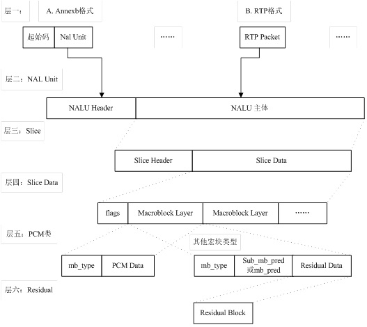
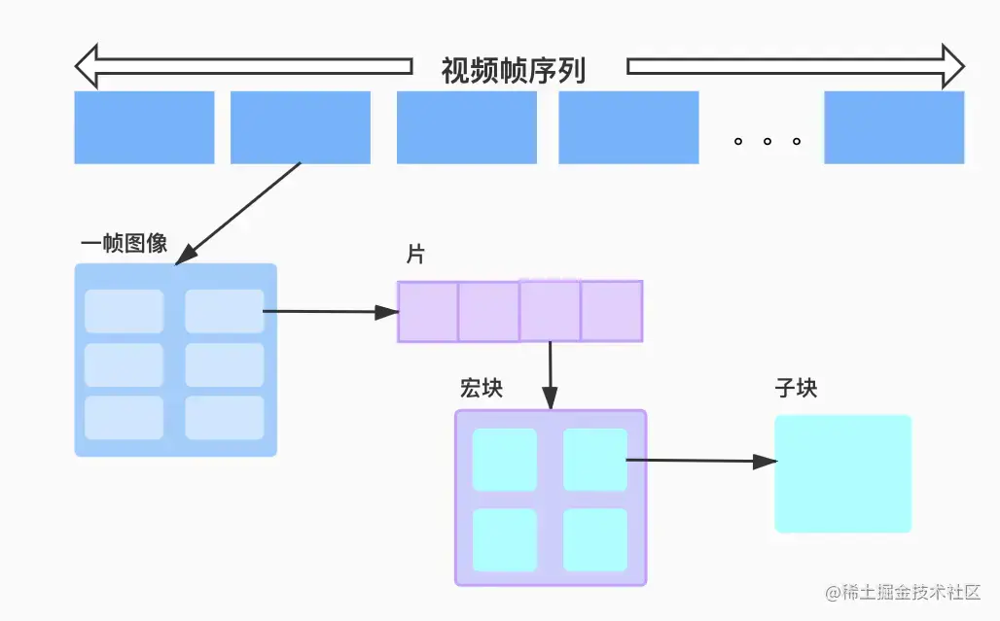
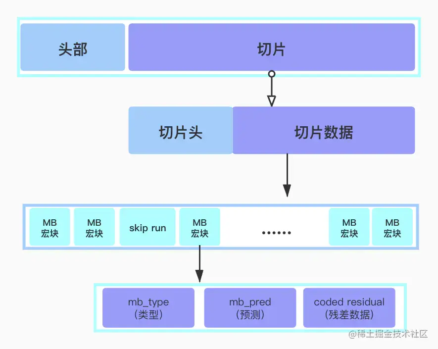
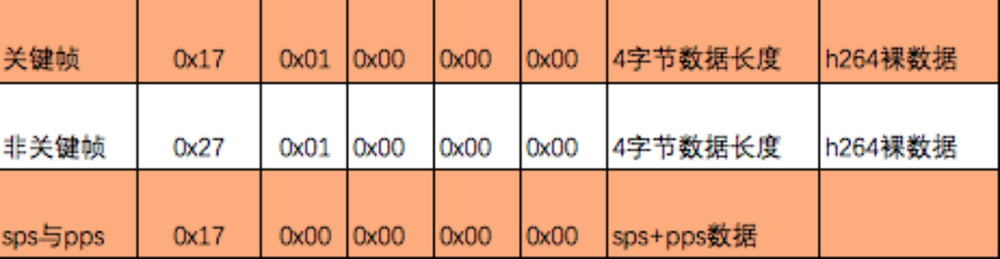
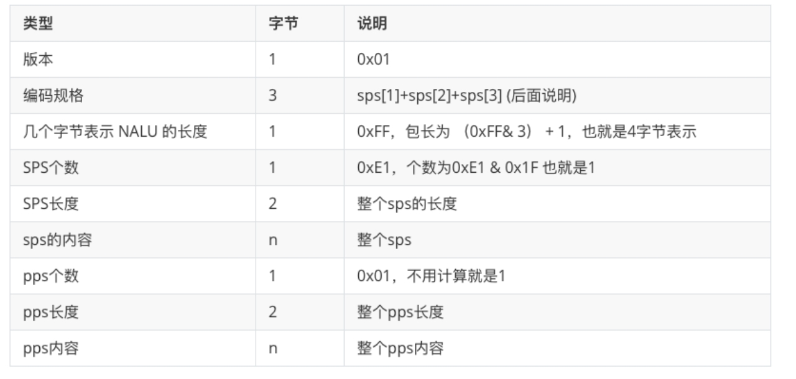
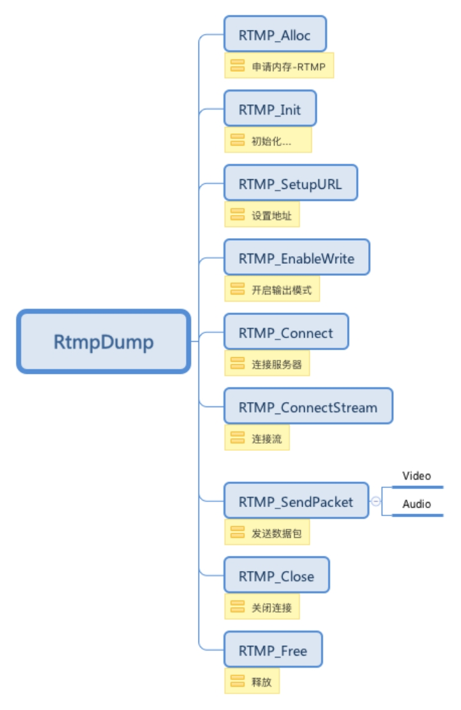

视频编解码(h264分析工具):

- Elecard Stream Eye https://www.elecard.com/products/video-analysis

- CodecVisa

- 雷神开发的工具 (Windows)

  是基于ffmpeg，像运动矢量、残差值等都可以通过ffmpeg获取到。
  下载地址1：https://jaist.dl.sourceforge/project/h265streamanalysis/binary/SpecialVH264.exe
  这个主要是用来分析H264码流的。

  下载地址2:
  https://sourceforge.net/projects/videoeye/files/
  这个工具很强大，包括运动矢量，残差值等

[Mac版 下载安装FFmpeg](https://blog.csdn.net/qq_45956730/article/details/125301182)

安装的时候有时候会报依赖库找不到，可能是因为脚本中下载的版本和当前下载的版本不一样，自己根据路径，找到对应文件，手动修改一下压缩包的文件名，然后再次执行安装命令。

ffmpeg 常用命令：https://www.jianshu.com/p/eb1e0b77cb49

提取视频流：

```sh
ffmpeg -i input.mp4 -vcodec copy -an out.h264
```

提取音频流：

```shell
ffmpeg -i out.mp4 -vn -ar 44100 -ac 2 -f s16le out.pcm
ffmpeg -i input.mp4 -acodec copy -vn out.aac
```

# 课题：H264视频编码原理

## 内容点：

1、信源编码器

2、视频序列，图像、片组、片、NALU、宏块、slice

3、运动估计与补偿、运动矢量

4、I、B、P帧详解

5、抖音中的GOP序列详解

6、实战H264编码

知识点：

1、封装格式

实际上就是一个容器，里面封装了视频流和音频流。

以前都是以本地文件的形式去播放，现在都是通过网络传输的方式去播放。

2、编码

本质就是为了压缩，不同的编码格式，压缩方式不同。

现在主流的编码方式：

ITU-T：H26x

ISO：Mpegx

从H264开始，ITU-T和ISO共同开发，H264/Mpeg4-AVC、H265/HEVC

谷歌：vp8、vp9在视频通话方面非常优秀

H261：第一个提出，块结构的混合编码

3、帧内预测

根据图像的复杂读，会用不同的预测模式，来确定图像像素的走势。

4、YUV相比RGB的优势

RGB需要三个独立的视频信号来传输，一个像素需要三个字节组成，才可以显示。需要三个带宽。

YUV（`Y'CbCr`）的Y表示的是亮度，UV表示的色度，没有色度，就是黑白显示。只需要一个带宽就行。

- Y（相当于灰度）的“亮度”分量
-  U（蓝色投影 Cb）和 V（红色投影 Cr）的“色度”分量

因为人眼对亮度比较敏感，而对色度不敏感，所以保持亮度数量，减少色度数量。在一幅图中，保持每个像素的亮度，适当的减少每个像素的色度，就可以大大减少图片大小。

- NV12 属于 YUV420SP 格式，其中 UV 分量共用一个平面并且以 U, V, U, V 的顺序交错排列。每四个 Y 分量共享一组 UV 分量。
- NV21 属于 YUV420SP，与 NV12 几乎一致，区别是 UV 平面中 U 与 V 的排列顺序颠倒，以 V, U, V, U 的顺序交错排列。

NV21 是 Android 相机（Camera）默认的输出格式。

NV12 是 iOS 相机（AVCaptureOutput）可直接输出的两种视频帧格式之一

**更多yuv详细的格式，参考 07->资料->yuv.png**

5、DSP芯片

主要是做视频编解码器的工作。是一个黑盒，里面有很多步骤。

1. CIF称为一个完整帧，一段视频有N个完整帧，由设备输入到完整帧。
2. 视频信源编码器，主要用来将一个完整帧实现块结构编码。
3. 视频复合器，将视频与声音进行混合
4. 传输缓冲器，缓冲待输出的图像与音频
5. 传输编码器，对视频和音频进行格式化，输出成h261码流。

6、编码原理

编码就是压缩，是为了减少冗余

帧内冗余

1. 划分N个宏块，每个宏块由4×4~16×16的网格组词，由像素变化程度决定。
2. 对每个宏块进行预测方向，确定像素渐变方向。
3. 然后对每个宏块以及它的预测方向这些数据进行序列化。

帧间冗余

前一帧和第二帧一般相差都不大，大部分静止的东西不会变，只要对部分运动的东西需要记录。

判断这个宏块，在前面有没有编码，编码过就不需要编码，通过进行运动估算，记录宏块的运动矢量信息。

7、I、B、P帧

I关键帧，一个视频的第一帧一定是I帧，里面包含视频的关键信息。

B运动补偿帧，根据前后帧，计算出的中间帧，只包含百分百信息。

P矢量帧，包含矢量信息、差异信息。

视频编码的顺序是 I、P、B，B帧会先在缓冲器中，等待P帧。

视频播放的顺序，是按帧率计算时间，然后根据时间戳PTS的顺序来播放。

I帧>P帧>B帧

8、GOP

GOP图像序列可以理解成一个场景，场景的物体都是相似的。

两个I帧之间，是一个图像序列，在一个图像序列中只有一个I帧

9、NAL

为了符合以太网的传输大小限制，需要对h264码流进行拆包和组包，就是通过NAL层（视频数据网络抽象层）去处理。

10、切片

分隔符 00 00 01 / 00 00 00 01

两个分隔符之间的字节数据，表示是一个NAL Unit，当你收到一片数据，如何判断数据的有效性，就需要判断有没有完整的分隔符。

为了处理像素数据也为 00 00 00 01的情况，在像素数据中插入03，00 00 03 00 01。

11、标识

分隔符后是 0x67 对应序列参数集SPS，0x68 对应图像参数集PPS，0x65表示I帧，0x41表示P帧。0x61表示B帧

12、H264码流分层结构



# 课题：03 实战任何视频流片段都能解析出完整帧技术

1、解码方式

软解：CPU，性能低，兼容高

硬解：专门的元器件（DSP），性能高，兼容低

程序中一般先使用硬解，硬件不兼容的使用软解。

2、MediaCodec

# 课题：04 MediaProjection录屏编码出的H264码流机制

## 内容点：

1、NAL单元详解

2、MediaProjection录屏使用与MediaCode编码

3、MediaCodec编码出来的H264数据与视频数据对比

4、sps和pps出现的次数，视频推流如何处理sps和pps

## 知识点：

1、sps、pps

sps 序列参数集 (Sequence Paramater Set)：基础配置帧，0x67标识，

- SPS 记录了编码的 `Profile`、`level`、图像宽高等
- 如果其中的数据丢失或出现错误，那么解码过程很可能会失败

pps 图像参数集 (Picture Paramater Set)：全量配置帧，0x68标识，包含纠错单元、优先级顺序、策略信息、编码等级等。

- 每一帧编码后数据所依赖的参数保存于 `PPS` 中

一般情况 `SPS` 和 `PPS` 的 `NAL Unit` 通常位于整个码流的起始位置。
封装文件一般只保存一次，位于文件头部，`SPS/PPS` 在整个解码过程中复用，不发生变化。有的也会出现多次，便于seek等操作。
然而对于实时流，通常是从流中间开始解码，因此需要在每个`I帧`前添加`SPS`和`PPS`；
如果编码器在编码过程中改变了码流参数（如分辨率），需要重新调整`SPS`和`PPS`数据。

# 课题：05 H265编码原理详解与码流分析

## 内容点：

1、H264在分辨率高的情况下的缺点

2、H265帧类型组成，两个字节表示

3、H265中的预测方向与编码流程

4、H265编码面试题

## 知识点：

1、在分辨率很高的屏幕情况下，即时以16×16的宏块去分割视频，也会产生大量的数据，压缩后的视频依然会非常大。

h264的算法是，只保留一行一列的像素，其余的丢弃。

h264宏块大小 4×4 ~ 16×16(像素)

h265宏块大小 8×8 ~ 64×64，这样就大大减少了数据量，但是计算时间会更长，更耗性能，以时间换空间。

2、H264的帧类型帧

一个标识帧占8位，第一位标识该帧是否有效，23位标识帧的重要性，剩下5位标识帧的类型(有32种)。

字节 & 0x1f (0001 1111)，就是在求该字节的帧类型

字节 & 0x60(0110 0000) >> 5，就是在求该字节的重要性

字节 & 0x80(1000 0000)>>7，就是在求该字节的有效性

3、H265的帧类型帧

h265在最前面多一个vps帧，3d配置帧，总共有64种帧类型。

用两个字节标识一个帧类型帧，总共16为，1位是有效位+6为类型位+6帧id+3帧id

两个字节，我们提前帧类型，只需关心前面一个字节。

字节 & 0x7E (0111 1110) >>1，就是在求该字节的帧类型

4、H264结构图



一个视频图像编码后的数据叫做一帧，一帧由一个片(slice)或多个片组成，一个片又由一个或多个宏块(MB)组成，一个宏块由多个子块组成，子块即16×16的yuv数据。**宏块是作为H264编码的基本单位。**

- 场和帧`：视频的一场或一帧可用来产生一个编码图像。
- `片`:每个图象中，若干宏块被排列成片的形式。片分为`I片、B片、P片`和`其他一些片`。
  - I片只包含I宏块，P片可包含P和I宏块，而B片可包含B和I宏块。
    - I宏块利用从当前片中已解码的像素作为参考进行帧内预测。
    - P宏块利用前面已编码图象作为参考图象进行帧内预测。
    - B宏块则利用双向的参考图象（前一帧和后一帧）进行帧内预测。
  - 片的目的是为了限制误码的扩散和传输，使编码片相互间是独立的。某片的预测不能以其它片中的宏块为参考图像，这样某一片中的预测误差才不会传播到其它片中去。
- 宏块:一个编码图像通常划分成若干宏块组成，一个宏块由一个16×16亮度像素和附加的一个8×8 Cb和一个8×8 Cr彩色像素块组成。

5、H264编码分层

- **NAL层:** **(Network Abstraction Layer,视频数据网络抽象层)**
  - 它的作用是H264只要在网络上传输,在传输的过程每个包以太网是1500字节. 而H264的帧往往会大于1500字节的.所以就要进行`拆包`. 将一个帧拆成多个包进行传输.所有的`拆包或者组包`都是通过`NAL层`去处理的.
- **VCL层:(Video Coding Layer,视频数据编码层)** 它的作用就是对视频原始数据进行压缩.

NALU结构图



6、预测方向

H264 有8种

H265 有32种

# 课题：06 用H265实现低延时投屏传输，带你从零实现高清无损的投屏神奇

## 内容点：

1、跨设备实现视频通话时，为什么需要先编码

2、H265编码与推送（摄像头层、 编码层、传输层）

3、MediaProjection与MediaCodec交互机制详解

4、从零手写投屏传输（推流端与播放端实现）

## 知识点：

1、播放端发现视频不清晰

如何定位问题，推流端 -> 服务器 -> 播放端

推流端编码后的数据不清晰

服务器对视频做了处理

播放端解码问题

可以保存一份推流数据，和播放端收到的数据做对比，如果数据一致，那就考虑是编码问题，如果编码后是清晰的，那就考虑是解码问题；如果数据不一致，那就考虑服务器问题。

2、投屏的三种策略

一、同一网段 192.168.1.1 ->192.168.1.2

​	使用socket

二、同一二级网段 192.168.1.1 -> 192.168.2.1

​	内网穿透技术，webtrc

三、公网

​	建立服务器

# 课题：07 从零实现手写音视频通话

## 内容点：

1、sps与pps交换，I P B交换机制

2、摄像头编码出H265码流

3、精讲Webrtc核心p2p底层原理

## 知识点：

1、NV21->NV12（YUV420)

Android摄像头采集的数据比较独特，是NV21，U和V交替排列，但是解码器没有NV21的类型，所以需要将数据转换成NV12的格式，V和U交替排列。就是要变换数组中的UV数据的位置。

2、摄像头旋转

Android摄像头因为硬件空间问题，基本上都是横向放置，所以我们拍处理的数据都需要经过旋转90°。这个时候，编码器的宽高也需要交换

如果编码视频的宽高不正确，那么可能出现很明显的宽条竖纹。

如果编码视频的数据有问题，那么可能出现绿屏

# 课题：08 从零手写音视频会议

## 内容点：

1、sps与pps交换，I P B交换机制

2、摄像头编码出H265码流

3、H265码流交换详解

4、一对一音视频通话

## 知识点：

1、音频

声音是一种波，通过介质传播，那么波如何保存？

- 音调：声音频率的高低叫做音调(Pitch),是声音的三个主要的主观属性,即音量(响度)、音调、音色(也称音品) 之一。表示人的听觉分辨一个声音的调子高低的程度。音调主要由声音的频率决定,同时也与声音强度有关

- 音量：人主观上感觉声音的大小（俗称音量），由“振幅”（amplitude）和人离声源的距离决定，振幅越大响度越大，人和声源的距离越小，响度越大。（单位：分贝dB）
- 音色：又称声音的品质，波形决定了声音的音色。声音因不同物体材料的特性而具有不同特性，音色本身是一种抽象的东西，但波形是把这个抽象直观的表现。音色不同，波形则不同。典型的音色波形有方波，锯齿波，正弦波，脉冲波等。不同的音色，通过波形，完全可以分辨的。

2、采样

根据人耳的听觉频率，进行适当的采样。

采样率（频率）：根据奈奎斯特定律，按照最高频率的两倍来采样，能保证采样到一个波周期的波峰个波谷两个点，这样就能正确的还原波形。44100kHz

量化位数（振幅 也就是响度）：两个字节，范围[-32768~ 32767]

声道数：双声道比单声道更具立体感

根据这些点，将数据进行格式化存储。

# 课题：09 视频会议与H264解析

## 内容点：

1、多对多会议聊天中，底层H265码流如何分发

## 知识点：

1、n:n的网络传输

视频会议，多对多，难点在于网络，不在于编解码

socket是一个1:n的模式，一个server 可以连接多个 client

那么每个手机实现一个socket端，就可以实现 n ：n

2、发送数据

一个编码器，编码摄像头的数据，创建多个Client，每个client连接的是不同远端的Server，然后轮训Client，将自己的数据发送给每个Server。

3、接收数据

为每个从远端接收到的数据，创建一个解码器，绑定一个surface。解码器不能复用，因为每个解码器对视频流解码时，其I P B帧是关联的，不能混着来。多个解码器会影响手机性能，他们是共享dsp的buffer。

4、H264编码

定长编码（固定编码）

​	解析方便，比如8位为一个单位，用一个字节(8位）表示一个像素，但是遇到数据比较小，那么就会造成空间的浪费。

变长编码（哥伦布编码）

5、比较常用的是0阶无符号指数哥伦布编码

编码：num + 1-> 二进制 -> 1后面有几位，1前面就补几个0

编码举例：6   -> 6+1=7 -> 111 -> 00111

解码：读取的时候，遇到0就记位，遇到1，就按照前面遇到几个0读取1后续几位。

解码举例：00111 -> 2个0，后续读取2位 11 ->  11还原十进制3 -> (1<<2) + 3 -1 = 4 + 3 - 1 = 6 (其实人类口算的话，也就是111 = 7 -> 7-1 = 6)

+1是为了处理0这样的像素数据，避免0的话，无法区分是数据还是长度，

**注意：因为yuv像素取值范围是0~255，所以最多占8位，数据量比较小，也就是最多前面补7个0，所以可以使用哥伦布编码，不浪费过多的空间。**

# 课题：10 深度解析H264码流，哥伦布编码在H264的应用

## 内容点：

1、为什么H264需要用哥伦布编码

2、哥伦布编码适合小数据频率块的场景

3、手写解析H264中的宽高

## 知识点：

1、解析sps帧

根据H264的官方文档，逐个二进制位的解析，整个二进制数据，按位还是按哥伦布，都有固定的规则。

参考：当期资料，H.264视频编码官方中文帮助文档.pdf->7.3.1 NAL单元语法

可以自己拿一个h264的码流文件，用16进制查看，然后自己解码成二进制，逐个去读他们的意思。

2、sps中的宽高信息

当读取到宽高信息时，存储的并不是实际宽高，而是按照16*16的宏块去存储的，而且宽高没有0×0，所以需要+1。

比如：解析出宽，计算得出是22，需要+1，最后的实际宽度 = (22+1)*16

# 课题：11 音视频剪辑原理，手写两个音频合成

## 内容点：

1、混音

## 知识点：

1、模拟h264解码

MediaCodec调用DSP进行二进制码流的解码，是硬件解码，我们无法调用DSP芯片，只模拟MediaCodec解码h264 sps和pps部分，解码得到视频的宽高等信息。

```java
//哥伦布编码 解码过程 java实现
private static int Ue(byte[] pBuff)
{
  int nZeroNum = 0;//记录0的数量
  while (nStartBit < pBuff.length * 8)//byte[]中存的数据是按字节为单位，我们现在是按位为单位来计算，所以要×8。
  {
    //从byte数组中不断向后取值，nStartBit/8保证每8位为一个字节，nStartBit % 8 计算当前二进制位处于当前字节的第几位，0x80 (1000 0000) >> 那么就右移几位，使用&来取当前位的值。
    //如果不等于0，继续向后，直到找到1
    if ((pBuff[nStartBit / 8] & (0x80 >> (nStartBit % 8))) != 0)
    {
      break;
    }
    nZeroNum++;
    nStartBit++;
  }
  nStartBit ++;//找到1后，还需要往后再+1位，才开始计算1后面的位数

  //以下和固定位编码 解码过程 相同
  int dwRet = 0;//结果
  for (int i=0; i<nZeroNum; i++)
  {
    dwRet <<= 1;//每次循环，左移1位，然后再加上下一位的数，这是二进制的加法算法
    if ((pBuff[nStartBit / 8] & (0x80 >> (nStartBit % 8))) != 0)
    {
      dwRet += 1;
    }
    nStartBit++;
  }
  return (1 << nZeroNum) + dwRet - 1;
  //哥伦布算法 高位的1左移0的个数，+ 1后面的值，最后-1。因为哥伦布算法需要兼容0，所以每个数都是+1后计算的，所以最后解码完要-1。
}
```

2、傅立叶公式

音频的合成和分解用到了傅立叶算法

两个音频叠加，就是把波相加

调节音量，就是给波的每个采样点×一个系数

噪音过滤，分解波之后，找到噪音波形，然后去除。寻找噪音是去噪音库寻找相似的波形。

# 课题：12 两个音频PCM合成实现混音，音频编码原理之高低字节

## 内容点：

1、高低字节

2、如何分别调整混音后的音量大小

3、音波叠加与解复用

4、手写音频混音

## 知识点：

1、给视频+背景音乐

1. 分离出视频的音频 

   使用MediaExtractor，系统为我们封装好的，解码音视频的工具，节省了我们之前自己去一帧一帧的手动读取解码。

   MediaExtractor存在轨道的概念，每个轨道存放一个音频或者视频流。

   我们可以获得每个轨道的MediaFormat，来判断当前轨道是音频还是视频。

   然后利用MediaCodec，将音频流解码输出PCM

2. 将背景音乐转解码为PCM

3. 将两个pcm混音

   就是将每个采样点相加，注意不是位相加，而是值相加，两个字节是一个采样点，还需要高低字节的转换。

4. 将混音后的pcm压缩成AAC

   因为pcm的数据量很大，一般还是需要压缩一下，压缩AAC需要添加ADST头

5. AAC合成到视频中

   提前视频中的视频流，不需要解码，直接合成

   合成使用MediaMuxter，它支持的封装格式比较少，常见的只要mp4

2、seek是一个比较难优化的点

seek到一个PB帧时，根据策略去选择前一个I帧或者后一个I帧作为起始点，因为只要I帧才能正确解码。这是非常不准，而且非常耗性能。可以做一些UI优化，或者缓存优化。

3、WAV封装格式

WAV头 + PCM，所以是无损压缩，音质好，占用空间大

4、高低字节

PCM中保存的数据，实际上是波，波放大之后，其实是一个个的采样点，一个点的范围是-32768~32767，需要两个字节来存储，两个字节涉及到高字节和低字节。高字节存在低八位，低字节存在高八位。

5、精度丢失

在调节音量大小时，结果 = 值 * volume，volume是一个0~1的值，我们一般会用类似这样的 11/100 来调节，如果 值 比较小的时候，计算结果可能为0，所以我们的 volume = 11f/100 * 1，将其转化成浮点数来避免。

6、混音要注意采样率

采样率相同，可以用上述方法直接合成，不同采样率，需要先解码后编码，转换成相同的才能计算。

# 课题：13 音频和视频的合成

## 内容点：

1、MediaExtractor、MediaMuxer

[MediaExtractor和MediaMuxer的使用](https://blog.csdn.net/indeedes/article/details/124869320)，这篇博客有音视频的几篇文章，总结的比较好

MediaExtractor 视频提取器，可以提前音频、视频的某个音轨的数据

MediaMuxer 视频混合器，可以生成音频、视频文件，也可以混合音频视频

MediaMuxer可以帮我们做解码、编码相关的工作，比MediaCodec简单一点，但是支持的格式比较少，也不够灵活。

# 课题：26 哔哩哔哩直播-手写哔哩哔哩硬编码录屏推流(硬编)

[RTMP 协议规范(中文版)](https://www.cnblogs.com/Kingfans/p/7083100.html)、[RTMP协议学习](http://lazybing.github.io/blog/2016/07/20/lib-trmp-source-code-study/#section) 

git项目，包含一些面试题，示例，教程 [audio_video_streaming](https://github.com/0voice/audio_video_streaming)

rtmp服务器环境搭建 [深入理解rtmp(一)之开发环境搭建](https://juejin.cn/post/6844904050891161614)

## 内容点：

1、rtmp协议与rtsp协议

2、利用硬编码对原始帧进行h264编码

3、直播关键帧触发机制，增加秒开率

4、从零实现将录屏画面推流到B站

## 知识点：

1、直播秒开度

怎么样能做到更快的秒开？

- 降低帧率。影响数据量最大的因素：帧率。直播一般帧率设置为  15/s
- 减少I帧时间间隔。
- 缓存GOP。GOP影响 加载速度、seek速度、缓存速度，一般设置200-800帧。服务器实时更新缓存一个最新的GOP，观看端连接的时候，立刻返回。

2、rtmp协议

如果像之前学的，将h264编码的数据直接推送给服务器，那么服务器需要根据0x 00 00 00 01分割帧，并且一帧一帧解析h264，得到相应的数据，这样服务器压力太大。

所以需要一个协议，帮助服务器更好的分发数据，不需要解码h264码流，就能过获取视频大部分信息。

帧类型：

- sps和pps，数据量比较小，不必分开
- 关键帧I帧
- 非关键帧P、B帧，比较相似，作为一个类型



sps与pps数据内容



3、rtmp工具库

下载地址：https://rtmpdump.mplayerhq.hu/

rtmpdump推流工具，类似Okhttp封装了http。

这个库是C库，需要用到JNI，我们下载到rtmpdump的库后，解压放到咱们的cpp目录下，然后编辑makefile，将其添加进去。

使用API流程：



4、将录屏的数据推流给Bilibili服务器

录屏后的数据，经过MediaCodec编码，只会生成一次sps、pps数据，但是服务器只是一个转发的地方，不维护各种逻辑，客户端如果没有第一时间接收到sps和pps数据，就无法继续解析后续的帧。

所以需要我们自己缓存sps和pps数据，并且间隔一定时间发送一次，保证客户端能正常接收到。

5、编码速率 传输速率

如果编码速率 > 传输速率，那么编码数据就会堆积，导致网络堵塞

如果编码速率 < 传输速率，正常。

使用生产者消费者模式，用阻塞队列来维护数据。

6、推送给B站

B站开直播后，会有一个服务器地址，我们只要把录屏采集到的数据，进行h264编码，然后通过rtmp库，推给服务器就行。

# 课题：27 哔哩哔哩直播-答疑

1、YUV一个像素占用width×height×3/2

因为Y占一个完整的字节width×height，UV与Y的比例是1：4，所以U占1/4(width×height)、V占1/4(width×height)

2、避免while循环中new对象，new数组

3、不同采样率的MP3混音，音调会变

比如两个音频采样率分别是48000和44100，他们需要先统一成一个采样率，那么不管是48000 -> 44100，还是44100 -> 48000，如果降低采样率，那么音质会变低，如果提高采样率，那么会补一些采样点，也会有一些变化。

4、解码抽帧速度如何像剪映一样快

其实解码速度是依赖于硬件的，是有瓶颈的。主要优化还是在其他方面，比如载入视频时，就需要提前缓存整个视频帧，然后在之后滑动进度条时，根据时间多线程并发加载缓存中的帧，可以更流畅。

5、音画不同步

音频的本质是波，不管波的振幅高低、频率快慢，算法是一致的，所以解码过程也是线性的。

视频分I、P、B帧，数据量 I > P > B，但是他们解码完成后，都是同样的大小。所以I帧解码最快，B帧的解码时间最长，因为它里面只有一些矢量信息，需要参照I帧等去生成完整的图像数据。因此视频解码过程是一会快一会慢。

两个频率速度不一样的解码器工作，肯定会造成音画不同步。

6、直播SDK的两种方案：低延时(3s)、高延时(7s)

主播端 -> 服务端 -> 用户端  比较耗时

主播端 -> 服务端 -> CDN -> 用户端  webrtc

7、回音

同一个设备系统内，可以消除，因为喇叭发出的声音，系统是知道的，麦克风录入时，可以把喇叭发出的声音过滤。比如KTV唱歌，音乐声不会产生回音

不同的设备之间，是无法消除的。比如两个设备很近的时候，打视频通话，A设备可以知道自己喇叭的声音，但是无法知道B设备喇叭发出的声音。

8、分辨率和码率无关

分辨率就是视频宽高

码率是每帧的大小，码率越大，视频质量越高，越清晰。码率越大,说明单位时间内取样率越大，数据流精度就越高，这样表现出来的的效果就是，视频画面更清晰画质更高。

9、视频传输过程中花屏

时间戳(PTS)设置要准确

10、直播时网络抖动断开链接，用户端需要重新初始化编码器吗？

如果推流端的 视频宽高、编码格式、等信息没变化，就可以继续使用。

如果推流端的手机屏幕旋转了，获取其他东西，影响了sps pps发生了变化，那么用户端肯定解码会失败，需要重新初始化。

11、webtrc技术可以降低投屏、音视频延时

12、native的crash怎么监听和记录

一个app运行，java和native是运行与同一个进程，java是有虚拟机管理，崩溃并不会导致进程结束，所以jvm会收集相关信息并打印出来，然后结束进程。但是native代码是系统管理的，和进程关联紧密，崩溃会直接导致进程结束，jvm肯定是捕捉不到，它只会由系统发出一个信号。

native崩溃，系统会开一个子进程来管理崩溃信息，所以我们需要把日志过滤调整为No Filter，才能看到其他进程的日志。

它的日志会打印出当前堆栈，找到backtrace，查看下面的信息，我们发现都是地址信息。使用我们NDK里的addr2line工具，将地址翻译成行号。

可以把该工具设置为系统环境变量，方便使用。

```
arm-linux-androideabi-addr2line -e libx264rtmplearn.so addr -s
aarch64-linux-android-addr2line -e libx264rtmplearn.so addr -s
```

# 课题：28 硬编码推流-音频推流

## 内容点：

1、rtmp协议中是否需要减去分隔符

2、RTMP、RTSP RTCP RTP协议的区别与应用场景

3、http协议实现直播功能流程

4、手写实现音频推流

## 知识点：

1、intN_t是位的精确宽度整数类型N，typedef名称intN_t指定宽度为N，无填充位和二进制补码表示形式的带符号整数类型。因此，int8_t表示这样的带符号整数类型，其宽度恰好为8位。

Int8_t、uint8_t、int16_t、uint16_t、int32_t、uint32_t、int64_t、uint64_t

它们都是typedef的结构体，Int8_t表示char，uint8_t表示服务号char，16就是short、32就是int、64就是long

2、rtmp与rtsp

rtmp 数据不安全，性能高，扩展性强，支持在线人数高

rtsp 数据安全，性能低，支持在线人数20

根据业务选择，比如直播用rtmp，监控用rtsp。

3、http实现直播

主播端---->摄像头->捕获的数据封装成一个个mp4

用户端----->不断的请求mp4数据，进行播放。

4、pk、连麦的实现

另起一个链接，用webrtc实时通话技术。

5、malloc/calloc/realloc之间区别

https://blog.csdn.net/weixin_43264873/article/details/104265538

6、生成so的位置

build/intermidiates/merged_native_libs下

7、用bilibili做位rtmp服务器

自己注册一个，开通直播 https://link.bilibili.com/p/center/index?visit_id=1xrke45sy98g#/my-room/start-live

就可以用它提供的rtmp地址进行推流 

```
"rtmp://live-push.bilivideo.com/live-bvc/?streamname=live_591087800_54220404&key=a9d59b8830a8a6013a7433b24e8f22c1&schedule=rtmp&pflag=1"
```


# 课题：29 直播推流(软编)-X264集成与Camera推流

## 内容点：

1、CameraX的使用

## 知识点：

1、预览宽高

每个Android设备都有固定的几个预览宽高选项，你设置的宽高，并不是最终采集到图像的宽高，而是会根据传入宽高，找到最匹配的一个宽高。因为这是由于摄像头厂商硬件所决定的。

Camera1：需要自己手动的去获取和匹配

CameraX：帮我们做了这件事

# 课题：30 直播推流(软编2)-X264集成与Camera推流

## 内容点：

1、交叉编译x264

## 知识点：

1、引入.so或者.a文件

```
include_directories(path) #添加库的头文件路径
set(CMAKE_CXX_FLAGS "${CMAKE_CXX_FLAGS} -Lpath) #添加库文件的路径

target_link_libraries() #链接里添加库名
```

2、x264配置参数

https://blog.csdn.net/lj501886285/article/details/105095694

```c++
	//帧率25fps
    param->i_fps_num       = 25;
    param->i_fps_den       = 1;

	 /* Encoder parameters 
	 * 帧类型决策相关 */
    param->i_frame_reference = 3;	//参考帧列表3帧
    param->i_keyint_max = 250;		//关键帧距离最大250帧
    param->i_keyint_min = X264_KEYINT_MIN_AUTO;
    param->i_bframe = 3;			//两个非B帧间最多3个B帧
    param->i_scenecut_threshold = 40;	//使用场景切换&&阈值40
    param->i_bframe_adaptive = X264_B_ADAPT_FAST;	//使用fast进行b帧自适应
    param->i_bframe_bias = 0;		
    param->i_bframe_pyramid = X264_B_PYRAMID_NORMAL;//任意B帧作为参考帧
    param->b_interlaced = 0;		//不使用场编码
    param->b_constrained_intra = 0;

	/* 环路滤波相关 */
    param->b_deblocking_filter = 1;	//开启环路滤波
    param->i_deblocking_filter_alphac0 = 0;	//环路滤波alpha值默认0
    param->i_deblocking_filter_beta = 0;	//环路滤波beta值默认0

	/* 熵编码相关 */
    param->b_cabac = 1;	//使用cabac
    param->i_cabac_init_idc = 0;

	/* 码控相关 */
    param->rc.i_rc_method = X264_RC_CRF;	//默认CRF码控
    param->rc.i_bitrate = 0;				//关闭ABR
    param->rc.f_rate_tolerance = 1.0;		//bitrate波动1%
	//关闭vbv
    param->rc.i_vbv_max_bitrate = 0;
    param->rc.i_vbv_buffer_size = 0;
    param->rc.f_vbv_buffer_init = 0.9;
    //关闭CQP
    param->rc.i_qp_constant = -1;
	//默认ratefactor为23
    param->rc.f_rf_constant = 23;
	//qp不设限，即[0,2^31-1]
    param->rc.i_qp_min = 0;
    param->rc.i_qp_max = INT_MAX;
    //帧间最大qp跨度为4
    param->rc.i_qp_step = 4;
	//I帧到P帧qscale转化因子
    param->rc.f_ip_factor = 1.4;
	//P帧到B帧qscale转化因子
    param->rc.f_pb_factor = 1.3;
	//帧内adaptive qp方法用variance
    param->rc.i_aq_mode = X264_AQ_VARIANCE;
	//adaptive ap强度1.0
    param->rc.f_aq_strength = 1.0;
    //码控lookahead队列长度40
    param->rc.i_lookahead = 40;

	/* 2pass相关 */
	//不写stat
    param->rc.b_stat_write = 0;
    param->rc.psz_stat_out = "x264_2pass.log";
	//不读stat
    param->rc.b_stat_read = 0;
    param->rc.psz_stat_in = "x264_2pass.log";
	//非线性压缩因子0.6
    param->rc.f_qcompress = 0.6;
    param->rc.f_qblur = 0.5;
    param->rc.f_complexity_blur = 20;
	//无zone
    param->rc.i_zones = 0;
	//使用mb tree
    param->rc.b_mb_tree = 1;

    /* 预测分析相关 */
	//允许intra4x4 intra8x8
    param->analyse.intra = X264_ANALYSE_I4x4 | X264_ANALYSE_I8x8;
	//允许intra4x4和8x8，inter 8x8 8x16 16x8 16x16之间
    param->analyse.inter = X264_ANALYSE_I4x4 | X264_ANALYSE_I8x8
                         | X264_ANALYSE_PSUB16x16 | X264_ANALYSE_BSUB16x16;
    param->analyse.i_direct_mv_pred = X264_DIRECT_PRED_SPATIAL;
	//运动搜索 六边形搜索
    param->analyse.i_me_method = X264_ME_HEX;
    param->analyse.f_psy_rd = 1.0;
    param->analyse.b_psy = 1;
    param->analyse.f_psy_trellis = 0;
	//运动搜索范围16个像素点
    param->analyse.i_me_range = 16;
	//下采样质量7
    param->analyse.i_subpel_refine = 7;
	//允许宏块各划分子块独立参考帧
    param->analyse.b_mixed_references = 1;
	//允许P帧进行色度运动估计
    param->analyse.b_chroma_me = 1;
    param->analyse.i_mv_range_thread = -1;
    param->analyse.i_mv_range = -1; // set from level_idc
	//色度qp偏移量为0
    param->analyse.i_chroma_qp_offset = 0;
	//使用快速pskip决定
    param->analyse.b_fast_pskip = 1;
	//开启权重双向预测
    param->analyse.b_weighted_bipred = 1;
	//权重单向预测方法
	param->analyse.i_weighted_pred = X264_WEIGHTP_SMART;
	//是否使用P帧残差系数阈值
    param->analyse.b_dct_decimate = 1;
	//开启8x8 int-DCT变换
    param->analyse.b_transform_8x8 = 1;
    param->analyse.i_trellis = 1;
    param->analyse.i_luma_deadzone[0] = 21;
    param->analyse.i_luma_deadzone[1] = 11;
	//不进行psnr/ssim计算
    param->analyse.b_psnr = 0;
    param->analyse.b_ssim = 0;

```

# 课题：31 直播推流(软编3)-x264编码

## 知识点：

1、Native子线程调用Java方法

Java主线程->JNI->Native，Java和Native都在同一个主线程，线程内部变量可以访问，Native可以直接使用JNIEnv来反射调用Java的方法。此时线程都归JVM来管理。

```
env->CallXXX()
```

此时Native如果开辟了子线程，那么子线程是由Linux管理，Native子线程和JVM主线程无法直接通信，而是需要通过JavaVM引擎来获取Java层的对象。

JavaVM可以通过JNI_OnLoad()方法获取到，这也是JNI的动态注册的方法。


# 课题：32 OpenGL基础01

## 内容点：

1、opengl渲染底层原理

2、opengl程序是运行在cpu还是gpu

3、opengl坐标系

4、opengl特效是怎么做的

## 知识点：

1、opengl运行于GPU

opengl的主要功能是渲染图像，也就是大量的计算，GPU很适合这样的工作。

2、图像绘制过程

大致流程：

1. 确定形状：矩形、圆形、三角形
2. 栅格化：把矢量图形转化为一个个像素点
3. 确定颜色：给每个像素赋值
4. 显示：根据颜色显示在显示屏上

1和3是我们程序需要做的

专业流程：

顶点着色器->图元装配->几何着色器->光栅化->片段着色器->测试与混合

3、着色器

着色器(Shader)是运行在GPU上的小程序，和我们编程相关的着色器有两个

- 顶点着色器（vertex shader）：如何处理顶点、法线等数据的小程序
- 片元着色器（fragment shader）：如何处理光、暗影、遮挡、环境等等对物体表面的影响，最终生成一副图像的小程序。

4、2D、3D图像都可以分解成三角形

三个顶点确定一个三角形，三角形是图像的最小元素。

5、坐标系转换

世界坐标系(0,0在中心，-1,-1左下角，1,1右上角) ->openGL坐标系(Android的0,0点在右上角，IOS、WINDOWS、LINUX系统的0,0点在左下角)

6、顶点着色器

描述一个矩形是，应该需要两个三角形，6个顶点，但是可以省略两个重复的顶多，省略为4个顶点。但是是严格按照前后顺序排列，不能随意更换顶点顺序。

7、AS插件

GLSL Plugins

8、加载gl代码

使用插件编写，就是为了更好看，实际上，gl程序就是一个字符串，和我们的代码一样，需要加载、编译、才能执行，是一种动态加载。

1. 创建程序
2. 加载程序
3. 编译程序

```java
//建立形状对应的世界坐标，2d就两个值一个坐标，3d就三个值一个坐标，加上z值，比如下面传入的是铺满屏幕的矩形。
float[] coord = {
  1.0f.1.0f,  //右上角
  -1.0f,1.0f,	//左上角
  1.0f,-1.0f, //右下角
  -1.0f,-1.0f};//左下角
//建立形状对应的纹理坐标，世界坐标系，需要转换成纹理坐标系，各个顶点对应
float[] texture_coord = {
  1.0f,0.0f,	//右上角
	0.0f,0.0f,	//左上角
  1.0f,1.0f,	//右下角
  0.0f,1.0f,};//左下角

//获取代码
String vertexShader = "";//着色器代码，可以从文件读取，也可以直接是个字符串
//创建顶点程序
int vShader = GLES20.glCreateShader(GLES.GL_VERTEX_SHADER);
//加载代码
GLES20.glShaderSource(vShader, vertexShader);
//编译代码
GLES20.glCompileShader(vShader);
//是否编译成功
int[] status = new int[1];
GLES20.glGetShaderiv(vShader, GLES20.GL_COMPILE_STATUS, status, 0);
if(status[0] != GLES20.GL_TRUE){
  //抛异常
}
//创建着色器程序
int program = GLES20.glCreateProgram();
//绑定顶点程序
GLES20.glAttachShader(program, vShader);
//链接着色器程序
GLES20.glLinkProgram(program);
//查看状态
GLES20.glGetProgramiv(program, GLES20.GL_LINK_STATUS, status, 0);
if(status[0] != GLES20.GL_TRUE){
  //抛异常
}
//释放顶点程序
GLES20.glDeleteShader(vShader);

//CPU传值到GPU
//定位变量在GPU的位置 vet4 vPosition;
int vPosition = GLES20.glGetAttribLocation(program, "vPosition");
//建立ByteBuffer通道，allocateDirect分配一块 Native 内存，这块内存不会被 Java 的垃圾回收器管理
FloatBuffer vertexBuf = ByteBuffer.allocateDirect(coord.length * 4)//一个float 占四个字节
  .order(ByteOrder.nativeOrder())//设置字节顺序
  .asFloatBuffer();//转换为Float型缓冲
//CPU传值给FloatBuffer
vertexBuf.put(coord);//向缓冲区中放入顶点坐标数据
vertexBuf.position(0);  //设置缓冲区起始位置
//FloatBuffer给到GPU变量，赋值方法是一个反复多次的，每一帧图像数据过来，都重新赋值。
GLES20.glUseProgram(program);//启用程序
vertexBuf.position(0);//每次读取，都重置
GLES20.glVertexAttribPointer(vPosition, 
                             2, //2d图像传2，3d图形传3，这是代表vertexBuf中几个值是一个坐标。
                             GLES20.GL_FLOAT, //精度
                             false, //标准化
                             0, 
                             vertexBuf);
GLES20.glEnableeVertexAttribArray(vPosition);//启用该变量
```

9、JNI调用Java方法

[**JNI：本地代码调用Java代码**](https://blog.51cto.com/u_13538361/5164301)

# 课题：33 Opengl基础02-(用Opengl实现摄像头灰色滤镜)

10、灰色滤镜

在片元着色器中，有一个内部变量gl_FragColor，给他赋值一个vec4类型的rgba，传的什么颜色，就显示什么颜色。所以我们可以通过灰度公式，来将rgb计算完成后再赋值给它。

```text
precision mediump float;
varying vec2 v_TexCoord;
uniform sampler2D u_TextureUnit;
void main() {
  vec4 src = texture2D(u_TextureUnit, v_TexCoord);
  float gray = (src.r + src.g + src.b) / 3.0;//rgb求均值
  gl_FragColor =vec4(gray, gray, gray, 1.0);
}
```

11、分屏特效

在片元着色器中，从采样器入手，正常情况下，采样器是按照原图从(0,0)点顺序采样，我们改变采样的位置，就可以实现分屏效果。

```
#extension GL_OES_EGL_image_external : require //有这句才能用samplerExternalOES
precision lowp float;//精确度 低
varying vec2 aCoord;//采样坐标
uniform samplerExternalOES  vTexture;//采样器采样的画布
void main() {
    float x= aCoord.x;
    float a = 1.0/3.0; //垂直三分屏，因为图像是经过旋转的，所以x是垂直方向
    if(x<a){//自定义x，y的采样位置
        x+=a;
    }else if(x>2.0*a){
        x -= 1.0/3.0;
    }
    vec4 rgba =  texture2D(vTexture,vec2(x,aCoord.y));
    gl_FragColor=rgba;
}
```

# 课题：34 Opengl基础03-Opengl加载图片以及Opengl重构

## 内容点：

1、GLSurfaceView加载bitmap图片

完成上节课的gl基本操作后，我们现在要创建纹理，然后给你把bitmap从cpu给到gpu

```java
int[] textures = new int[1];
//创建纹理
GLES20.glGenTextures(1, textures, 0);//1代表创建1个纹理，创建n个，数组大小就是n
//使用纹理
GLES20.glBindTexture(GL_TEXTURE_2D, textures[0]);//绑定位2d纹理
//设置参数
GLES20.glTexParameterf(
  GLES20.GL_TEXTURE_2D,//纹理目标类型
  GLES20.GL_TEXTURE_WRAP_S,//纹理轴，s水平方向，t垂直方向
  GLES20.GL_CLAMP_TO_EDGE//环绕方式 这里是拉伸，还有repeat重复，镜像，居中，
);
GLES20.glTexParameterf(
  GLES20.GL_TEXTURE_2D,//纹理目标类型
  GLES20.GL_TEXTURE_WRAP_T,//纹理轴，s水平方向，t垂直方向
  GLES20.GL_CLAMP_TO_EDGE//环绕方式 这里是拉伸，还有repeat重复，镜像，居中，
);
GLES20.glTexParameterf(
  GLES20.GL_TEXTURE_2D,//纹理目标类型
  GLES20.GL_TEXTURE_MAG_FILTER,//放大后过滤类型
  GLES20.GL_LINEAR	//线性，平滑的处理
);
GLES20.glTexParameterf(
  GLES20.GL_TEXTURE_2D,//纹理目标类型
  GLES20.GL_TEXTURE_MIN_FILTER,//缩小后过滤类型
  GLES20.GL_NEAREST //8-bit显示模式，马赛克状，红白机的那种画面感
);

//把bitmap添加到纹理
GLUtils.texImage2D(GLES20.GL_TEXTURE_2D,0,bitmap,0);

//现在使用采样器，去采样纹理，就可以显示到屏幕
//激活图层，
GLES20.glActiveTexture(0);//总共有32个图层，和ps的概念一样
//绑定，把内存/纹理textureId 放到纹理
GLES20.glBindTexture(GLES20.GL_TEXTURE_2D, textureId);
//获取到 片元程序，变量inputImageTexture的位置mInputTexture，并将图层0交给它
//uniform sampler2D inputImageTexture
GLES20.glUniform1i(mInputTexture, 0);
//绘制
GLES20。glDrawArrays(GLES20.GL_TRIANGLE_STRIP, 0, 4);

GLES20.glBindTexture(GLES20.GL_TEXTURE_2D, 0);//0就是解绑图层和纹理
```

```
//片元程序
varying highp vec2 textureCoordonate;//这会从顶多着色器传过来
uniform sampler2D inputImageTexture;//这是上面java代码赋值
void main(){
	gl_FragColor = texture2D(inputImageTexture, textureCoordonate);//根据坐标，在图层上采样。
}
```

2、抽象封装OpenGL滤镜类

考虑到两点：

- OpenGL程序使用流程，是固定的。

  加载GPU程序

  定位gpu程序变量

  传值、渲染

- 滤镜是可以叠加的

因此可以封装到父类，便于使用。


